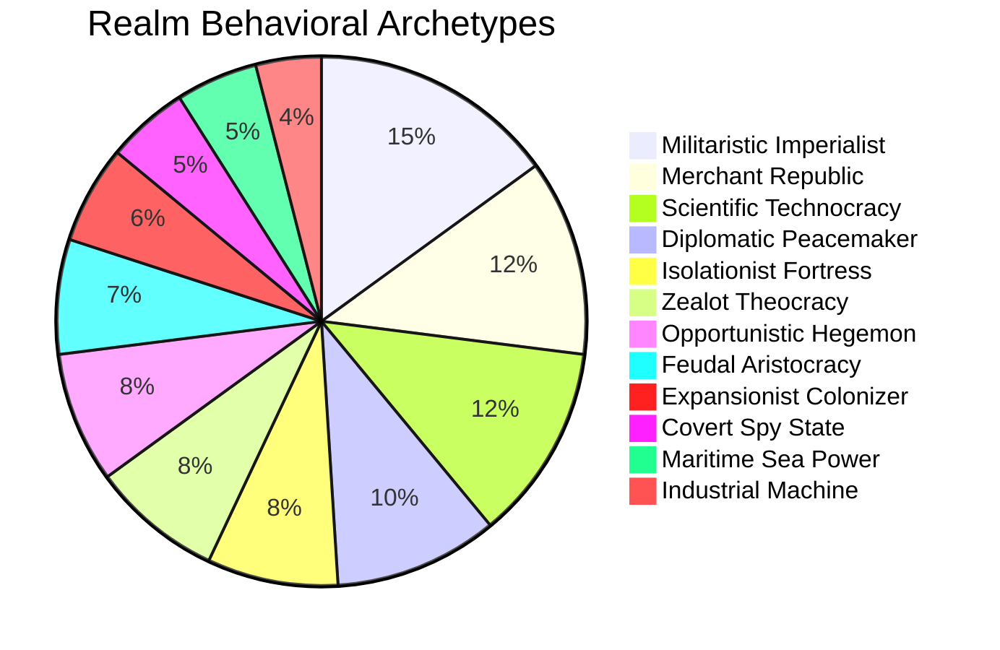
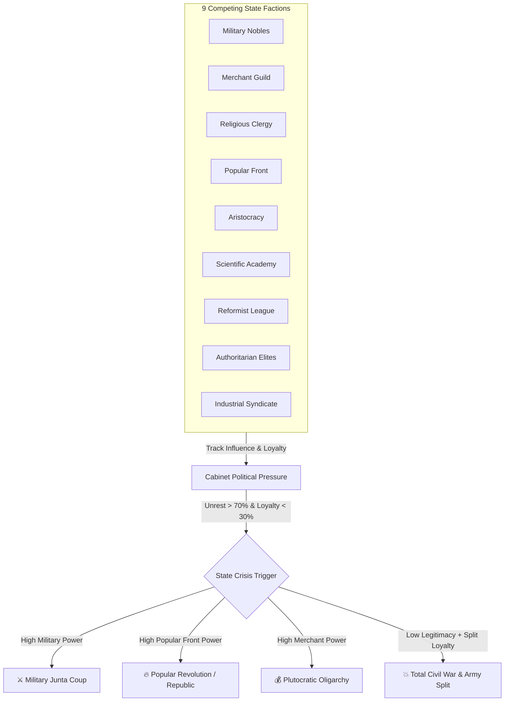
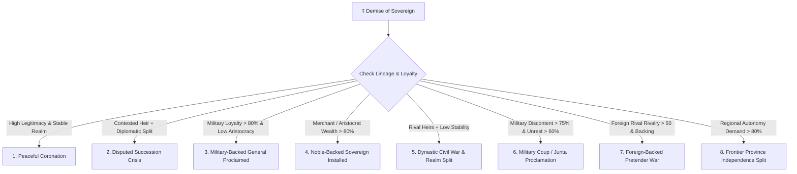
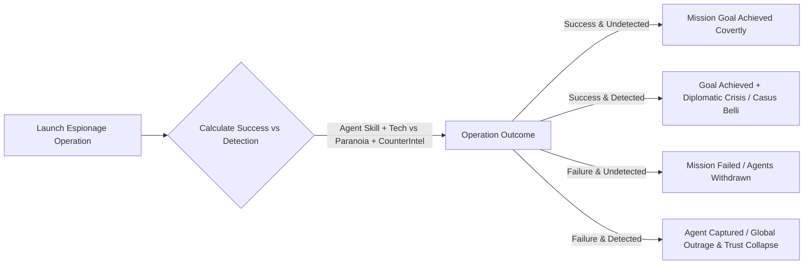

**AEON** is an advanced, high-performance, deterministic C++17 geopolitical civilization engine and digital life evolutionary simulator. Every realm in the world lives, calculates, plots, remembers, and reacts through autonomous AI agents and deep simulation systems. 

Rather than relying on static scripts or pre-baked narrative trees, **every war, alliance, betrayal, succession crisis, technological revolution, coup d'état, and economic collapse emerges organically** from mathematical simulation state, multi-dimensional relational memory, internal political factions, and sovereign ruler psyches.

---

## 📑 Table of Contents

1. [Architectural Philosophy](#-architectural-philosophy)
2. [Global Architecture Diagram](#-global-architecture-diagram)
3. [Deep Simulation Subsystems](#-deep-simulation-subsystems)
   - [1. 8-Dimensional AI Memory & Differential Decay](#1-8-dimensional-ai-memory--differential-decay)
   - [2. 12 Realm Personalities & 9 Permanent National Weights](#2-12-realm-personalities--9-permanent-national-weights)
   - [3. 14 Ruler Psyche Parameters & Utility Drivers](#3-14-ruler-psyche-parameters--utility-drivers)
   - [4. 9 Domestic Political Factions & Civil War Mechanics](#4-9-domestic-political-factions--civil-war-mechanics)
   - [5. 8-Branch Dynastic Succession Engine](#5-8-branch-dynastic-succession-engine)
   - [6. Multi-Tier Alliances, War Mobilization & Betrayal Cascades](#6-multi-tier-alliances-war-mobilization--betrayal-cascades)
   - [7. Covert Espionage & Hidden Intelligence Operations](#7-covert-espionage--hidden-intelligence-operations)
   - [8. 10-Branch Compounding Technology Tree](#8-10-branch-compounding-technology-tree)
   - [9. Strategic Resources, Supply/Demand & Regional Logistics](#9-strategic-resources-supplydemand--regional-logistics)
   - [10. 3-Tier AI Strategic Planning & Dynamic Utility Scoring](#10-3-tier-ai-strategic-planning--dynamic-utility-scoring)
   - [11. "AEON DAILY" World News & Grand Imperial Chronicler](#11-aeon-daily-world-news--grand-imperial-chronicler)
   - [12. Digital Life & Continuous Neural Evolution Engine](#12-digital-life--continuous-neural-evolution-engine)
4. [Codebase & File Structure](#-codebase--file-structure)
5. [Building & Installation](#-building--installation)
6. [CLI Execution, Headless Benchmarking & Testing](#-cli-execution-headless-benchmarking--testing)
7. [GUI Controls & Interactive Dashboard](#-gui-controls--interactive-dashboard)

---

## 🏛 Architectural Philosophy

```
  ┌─────────────────────────────────────────────────────────────────────────┐
  │                           AEON CORE PILLARS                             │
  ├──────────────────┬──────────────────┬─────────────────┬─────────────────┤
  │ 100% Determinism │ Emergent Story   │ Multi-Factor AI │ Explainability  │
  │ Seed-reproducible│ No hardcoded     │ 14 traits +     │ Real-time math  │
  │ simulation state │ scripted paths   │ 8-dim memories  │ breakdown logs  │
  └──────────────────┴──────────────────┴─────────────────┴─────────────────┘
```

1. **Strict Determinism**: Given a fixed seed (e.g. `--seed 42`), the simulation produces identical state transitions, wars, market fluctuations, and ruler choices across every run.
2. **Pure Emergence**: No artificial "scripted story triggers." Rulers declare war, assassinate rivals, or forge federations strictly because their dynamic utility formulas, memories, and factional pressures dictate it.
3. **No Static Utility Locking**: Prevents repetitive static score loops through logarithmic diminishing returns, fatigue cooldowns, opportunity costs, and strategic plan alignment.
4. **Transparent Explainability**: Every AI action generates an inline `[UTILITY BREAKDOWN]` log detailing every positive and negative mathematical factor that drove the ruler's decision.

---

## 📐 Global Architecture Diagram

```mermaid
flowchart TB
    subgraph CoreWorldEngine [AEON Core Engine (Annual / Monthly Tick)]
        DEMO[Demographics & Population Growth] --> ECON[Market Economics & Central Bank]
        ECON --> RES[Strategic Resources & Supply/Demand]
        RES --> TECH[10-Branch Technology Tree]
        TECH --> MIL[Military Logistics & Tactical Battles]
        MIL --> FACTIONS[9 Political Factions & Coup Evaluation]
        FACTIONS --> DYNASTY[8-Branch Succession Engine]
        DYNASTY --> ESPIONAGE[Covert Espionage Agency]
    end

    subgraph MemoryGraph [Bilateral Relational Memory Matrix]
        MEM[(8-Dimensional Memory State\nTrust | Fear | Hatred | Respect\nGratitude | Suspicion | Debt | Rivalry)]
    end

    subgraph AIHierarchy [Multi-Tier Autonomous Ruler AI]
        PLAN[3-Tier Strategic Planning\nImmediate | Medium | Long-Term Grand Doctrine]
        TRAITS[14 Ruler Psychological Traits]
        NAT_PERS[12 Realm Personality Archetypes]
        
        PLAN & TRAITS & NAT_PERS --> SCORER[Dynamic Multi-Factor Utility Scorer]
        MEM --> SCORER
        SCORER --> FATIGUE[Fatigue Cooldown & Anti-Spam Filter]
        FATIGUE --> ACTION[Authoritative Decision Execution]
    end

    subgraph NarrativeLayer [Living History & Chronicle]
        ACTION --> HIST[(Historical Event Log & Epoch Tracker)]
        HIST --> DAILY[📰 AEON DAILY Newspaper]
        HIST --> OLLAMA[Grand Chronicler / LLM Historian]
    end

    CoreWorldEngine <--> MemoryGraph
    MemoryGraph --> AIHierarchy
    AIHierarchy --> CoreWorldEngine
    CoreWorldEngine --> NarrativeLayer
```

---

## 🔬 Deep Simulation Subsystems

### 1. 8-Dimensional AI Memory & Differential Decay

Every realm tracks continuous memory vectors for every other known power. Rather than a flat "reputation" scalar, bilateral relations are tracked across 8 independent cognitive axes:

$$\text{Memory Vector} = \begin{bmatrix} \text{Trust} & \text{Fear} & \text{Hatred} & \text{Respect} \\ \text{Gratitude} & \text{Suspicion} & \text{Debt} & \text{Rivalry} \end{bmatrix}$$

| Dimension | Range | Accumulation Trigger | Decay Rate ($\lambda$) | Half-Life |
| :--- | :---: | :--- | :--- | :--- |
| **Trust** | $[-100, +100]$ | Honor treaties, fulfill trade deals | Slow ($+0.25/\text{yr}$ if negative, $-0.10/\text{yr}$ if positive) | $\sim 30\text{ years}$ |
| **Fear** | $[0, 100]$ | Army size disparity, adjacent military buildups | Moderate ($-1.2/\text{yr}$) | $\sim 8\text{ years}$ |
| **Hatred** | $[0, 100]$ | War declarations, civilian casualties, strikes | Very Slow ($-0.3/\text{yr}$) | $\sim 45\text{ years}$ |
| **Respect** | $[0, 100]$ | Technological era, GDP dominance, military feats | Slow ($-0.5/\text{yr}$) | $\sim 20\text{ years}$ |
| **Gratitude** | $[0, 100]$ | Emergency war aid, deficit loans, defensive joins | Moderate ($-0.8/\text{yr}$) | $\sim 12\text{ years}$ |
| **Suspicion** | $[0, 100]$ | Border mobilizations, detected spy operations | Slow ($-0.5/\text{yr}$) | $\sim 20\text{ years}$ |
| **Debt** | $[-100, +100]$ | Diplomatic favors, asymmetric concessions | Moderate ($-0.7/\text{yr}$) | $\sim 15\text{ years}$ |
| **Rivalry** | $[0, 100]$ | Direct border overlap, competing trade spheres | Stable / Structural ($-0.2/\text{yr}$) | $\sim 50\text{ years}$ |

```mermaid
graph LR
    subgraph TraumaticMemory [Traumatic Event (Betrayal / Annexation)]
        E1[Ally Betrayed in War] -->|Instantly| H1[Hatred +60\nSuspicion +50\nTrust -70]
        H1 -->|Differential Decay (0.3/yr)| H2[Grudge Persists Across Generations]
    end
    subgraph CooperativeMemory [Cooperative Event (Mutual Defense)]
        E2[Joined Defensive War] -->|Instantly| T1[Trust +40\nGratitude +50\nRespect +30]
        T1 -->|Decennial Normalization| T2[Strong Foundation for Federation]
    end
```

---

### 2. 12 Realm Personalities & 9 Permanent National Weights

National identities persist beyond the lifespans of individual rulers. Each civilization is instantiated with a **Realm Personality Archetype** and **9 Permanent Strategic Weights**:



#### National Weight Profiles:
- **`aggression_bias`**: Baseline threshold for military mobilization.
- **`expansion_drive`**: Propensity to colonize wilderness or annex frontier provinces.
- **`diplomatic_openness`**: Receptivity to alliances, embassies, and multilateral summits.
- **`trade_focus`**: Priority placed on merchant fleets, caravans, and market monopolies.
- **`scientific_curiosity`**: Allocation of national GDP towards tech academies.
- **`honor_rating`**: Probability of honoring alliance treaties vs opportunistic betrayal.
- **`paranoia_level`**: Investment in counter-intelligence and border fortification.
- **`risk_appetite`**: Willingness to engage in high-variance or asymmetrical wars.
- **`reform_speed`**: State capacity to transition government forms smoothly.

---

### 3. 14 Ruler Psyche Parameters & Utility Drivers

Ruler characters are modeled with 14 continuous psychological attributes $[-1.0, +1.0]$ or $[0.0, 1.0]$:

```
┌──────────────────┬─────────────────────────────────────────────────────────────┐
│ Trait            │ Behavioral Impact on AI Decision Utility                    │
├──────────────────┼─────────────────────────────────────────────────────────────┤
│ Ambition         │ Drives expansionism, empire proclamation, and hegemony goals │
│ Intelligence     │ Boosts tech prioritization, espionage success, and foresight│
│ Diplomacy        │ Prioritizes defensive pacts, trade treaties, and peace deals│
│ Patience         │ Buffs utility for building infrastructure vs hasty wars     │
│ Paranoia         │ Elevates defensive spending, purges, and counter-intel ops  │
│ Greed            │ Maximizes taxation, resource monopolies, and trade treaties │
│ Charisma         │ Increases popular legitimacy and lowers faction revolt risk │
│ Cruelty          │ Punishes rebel factions ruthlessly; reduces war hesitation  │
│ Risk Tolerance   │ Increases willingness to launch preemptive or underdog wars │
│ Loyalty          │ Disincentivizes breaking treaties and betraying allies      │
│ Reform Tendency  │ Promotes constitutional democracy, civil rights, and courts │
│ Authoritarianism │ Centralizes state power; prone to declaring dictatorships   │
│ Ego              │ Triggers severe diplomatic backlash upon insults or slights │
│ Morality         │ Restrains covert bio-warfare, assassinations, and sabotage  │
└──────────────────┴─────────────────────────────────────────────────────────────┘
```

---

### 4. 9 Domestic Political Factions & Civil War Mechanics

Realms contain 9 internal factions competing for dominance. If a faction's **Satisfaction** falls below $25\%$ while its **Power** exceeds $40\%$, a **Rebellion Risk** escalates toward civil war or a coup.



---

### 5. 8-Branch Dynastic Succession Engine

Upon the demise of a monarch or supreme autocrat, `evaluate_succession()` evaluates dynastic lineage, cabinet support, and military loyalty across 8 branching outcomes:



---

### 6. Multi-Tier Alliances, War Mobilization & Betrayal Cascades

International diplomacy features 5 distinct treaty tiers:
1. **Defensive Pact (Article 5)**: Automated mutual defense obligations against unprovoked aggression.
2. **Full Military Alliance**: Offensive and defensive combined-arms coalition.
3. **Research League**: Shared scientific breakthrough bonuses ($+15$ tech points/yr).
4. **Economic Union**: Unified tariff-free trade zone ($+0.8\%$ compounding annual GDP bonus).
5. **Pan-Continental Federation**: Deep diplomatic integration and unified foreign policy.

#### ⚔️ Ally War Response Matrix
When an ally is attacked, members evaluate 5 emergent choices:
- `JOIN_WAR` — Fully mobilize military forces and declare war on the aggressor.
- `SEND_EXPEDITIONARY_FORCE` — Transfer $30\%$ military units as foreign volunteer corps.
- `SEND_FINANCIAL_SUBSIDIES` — Transfer emergency gold reserves ($15\%$ treasury/yr).
- `REMAIN_NEUTRAL` — Refuse mobilization; dishonors treaty and causes moderate trust loss.
- `BETRAY_AND_ATTACK` — Attack the beleaguered ally from the rear (opportunistic backstab).

> **💥 The Betrayal Cascade**: If a realm betrays an active alliance, its **Continental Trust collapses by $-50$**, **Global Suspicion surges by $+40$**, and all sovereign neighbors gain a permanent casus belli against the traitor.

---

### 7. Covert Espionage & Hidden Intelligence Operations

Realms conduct clandestine operations through their Intelligence Ministries:



#### 8 Espionage Mission Types:
- `SPY`: Infiltrate high command, reveal army positions, and uncover treasury reserves.
- `STEAL_TECHNOLOGY`: Steal research blueprints from technological leaders.
- `SABOTAGE`: Detonate industrial supply lines, arsenals, or grain silos.
- `INFILTRATE_MILITARY`: Bribe generals and reduce enemy combat efficiency by $-25\%$.
- `FUND_REBELS`: Transfer covert gold to domestic insurgent factions to incite civil war.
- `STEAL_RESOURCES`: Siphon oil, uranium, and rare earth minerals from sovereign stockpiles.
- `COUNTER_INTELLIGENCE`: Execute domestic sweeps to capture and eliminate foreign spy rings.
- `DISCOVER_SECRET`: Uncover hidden strategic doctrines and secret agendas of foreign rivals.

---

### 8. 10-Branch Compounding Technology Tree

Technological progress spans 5 historical eras across 10 independent research branches:

```
 🏛️ Agriculture Era ──► ⚙️ Steam & Iron ──► 🏭 Industrial ──► ⚡ Atomic Age ──► 🚀 Space & AI
```

```
├── 1. AGRICULTURE : Crop Rotation ──► Mechanized Ag ──► Genetic Crops
├── 2. MILITARY    : Bronze Smelting ──► Iron Metallurgy ──► Gunpowder ──► Combined Arms
├── 3. INDUSTRY    : Steam Engine ──► Industrial Automation ──► Advanced Robotics
├── 4. SCIENCE     : Scientific Method ──► Electromagnetism ──► Quantum Computing
├── 5. MEDICINE    : Antibiotics ──► Advanced Surgery ──► Cellular Gene Therapy
├── 6. ENERGY      : Electrical Power ──► Nuclear Fission ──► Clean Fusion Power
├── 7. AI          : Autonomous Systems ──► Algorithmic Networks ──► Synthetic Superintelligence
├── 8. ECONOMICS   : Central Banking ──► Double-Entry Markets ──► Algorithmic Global Trade
├── 9. NAVAL       : Caravels ──► Armored Ironclads ──► Nuclear Submarine Fleets
└── 10. AEROSPACE  : Aviation ──► Orbital Rocketry ──► Kinetic Strike Space Defense Grids
```

---

### 9. Strategic Resources, Supply/Demand & Regional Logistics

Realms compete for 10 vital strategic resources that determine military capabilities and industrial output:

| Resource | Primary Strategic Use | Scarcity Impact if Depleted |
| :--- | :--- | :--- |
| **Grain & Food** | Sustains population growth and army supplies | Famine, unrest surges, population decline |
| **Iron & Steel** | Construction of heavy infantry, armor, and factories | $-40\%$ military equipment output |
| **Timber & Stone** | Early-game fortifications, city infrastructure, and caravels | Slower building construction times |
| **Oil & Hydrocarbons**| Fuels mechanized armies, tanks, and aviation units | $-50\%$ combat speed and mechanized logistics |
| **Uranium** | Nuclear energy plants and atomic warhead arsenals | Inability to build or maintain nuclear deterrents |
| **Rare Earth Metals**| High-tech electronics, radar arrays, and computer chips | Halts advanced AI and quantum tech research |
| **Gold & Silver** | Currency backing, foreign loans, and mercenary contracts | Monetary inflation and treasury devaluation |
| **Water** | Arid region survival, hydroponics, and crop irrigation | Desertification and province desertion |
| **Lithium & Silicon** | Battery storage, robotics, and electrical grids | Caps industrial automation efficiency |
| **Helium-3** | Late-game spaceborne clean fusion reactors | Constrains orbital defense grids |

---

### 10. 3-Tier AI Strategic Planning & Dynamic Utility Scoring

AI rulers plan over three distinct temporal horizons:
- **Immediate Goal** ($1\text{--}3\text{ years}$): e.g., `WAR_MOBILIZATION`, `TRADE_SURGE`, `EXPAND_TERRITORY`.
- **Medium-Term Plan** ($5\text{--}15\text{ years}$): e.g., `TECH_SUPERIORITY`, `FORM_FEDERATION`, `CONTAIN_RIVAL`.
- **Long-Term Grand Doctrine** ($25+\text{ years}$): e.g., `CONTINENTAL_HEGEMON`, `ISOLATED_FORTRESS`, `GLOBAL_MERCHANT`.

#### Mathematical Utility Scorer:
$$\text{Utility}(A) = \left( \text{Base} + \sum W_i \cdot \text{Trait}_i + \sum M_j \cdot \text{Memory}_j + \text{PlanBonus} \right) \cdot \text{FatiguePenalty}$$

#### Transparent Real-Time `[UTILITY BREAKDOWN]` Output:
```text
[YEAR 2030] AI SOLARIA decided: PROPOSE_TRADE [rule] -- "SOLARIA proposes a bilateral 10-year trade pact with NORDRA."
           Ruler: Empress Miriel I (Diplomat, Skill: 0.72) | Goal: Establish Federation
[UTILITY BREAKDOWN] (State: Stab:95% Unrest:0% Inst:50% MilLoyal:85% Legit:80%)
  1. PROPOSE_TRADE vs NORDRA = 0.843 (trst:+0 wealth:+100% greed:+10% merchant_fac:+0%)
  2. PROPOSE_TRADE vs ELDORIA = 0.843 (trst:+0 wealth:+100% greed:+10% merchant_fac:+0%)
  3. BUILD_INFRASTRUCTURE = 0.696 (econ_cap:100% stability:95%)
  4. RESEARCH = 0.520 (sci_pref:+65% gap:+12% intellect:+15%)
```

---

### 11. "AEON DAILY" World News & Grand Imperial Chronicler

At the conclusion of each simulation year, the engine analyzes global state deltas to publish **AEON DAILY**:

```text
📰 [AEON DAILY — YEAR 2030]
  MILITARY: 'NORDRA maintains continental military superiority with 806 power.'
  ECONOMY: 'THE COMMONS powers global trade, holding the world's largest economy ($8422 GDP).'
  POLITICS: 'NORDRA governed under Grand Duke Miriel I (Monarchy).'
  CRISIS: 'Continental borders remain stable under current peace accords.'
  DIPLOMACY: 'MYRMIDON and NORDRA sign a 10-year bilateral trade agreement.'
```

#### Asynchronous LLM Grand Chronicler:
Every 25 years, the **Grand Imperial Chronicler** batches all raw historical events and prompts an Ollama LLM (`llama3.1`) to author narrative historical chapters, compiling a continuous *Grand Book of Aeon*.

---

### 12. Digital Life & Continuous Neural Evolution Engine

In addition to geopolitical civilization simulation, AEON features an integrated **Digital Life Evolutionary Engine**:
- **Continuous Evolution**: No discrete generational breaks; live birth, energy expenditure, reproduction, and natural selection.
- **707-Gene DNA Chromosome**: Controls organism morphology, metabolism, sensor ranges, speeds, and neural topologies.
- **GRU Recurrent Neural Network (700 weights)**: Allows organisms to maintain temporal memory for navigation and hunting.
- **Divine LLM Decrees**: Every 20 seconds, the world environment can be dynamically perturbed by natural disasters, food surges, plagues, and climate shifts.

---

## 📂 Codebase & File Structure

```
evolva/
├── src/
│   ├── aeon_alliances.h/.cpp       # Multi-tier alliance treaties & war mobilization
│   ├── aeon_character.h/.cpp       # 14 ruler parameters, characters & dynasty lines
│   ├── aeon_chronicler.h/.cpp      # AEON DAILY newspaper & LLM Grand Chronicler
│   ├── aeon_civilization.h/.cpp    # Realm personalities, provinces & state structs
│   ├── aeon_dynasty.h/.cpp         # 8-branch succession crisis & coronation engine
│   ├── aeon_engine.h/.cpp          # Master authoritative simulation loop & yearly tick
│   ├── aeon_government.h/.cpp      # 9 political factions, coups & democratic reforms
│   ├── aeon_history.h/.cpp         # 8-dimensional bilateral memory graph & epoch records
│   ├── aeon_ruler_ai.h/.cpp        # 3-tier strategic planning & dynamic utility scorer
│   ├── aeon_space_espionage.h/.cpp # 8 covert intelligence & sabotage operations
│   ├── aeon_tech_tree.h/.cpp       # 10-branch technological research tree
│   ├── aeon_test_government.h/.cpp # 10-scenario automated political crisis test suite
│   ├── aeon_world_types.h          # Global enums, faction types & strategic resources
│   ├── main.cpp                    # Application entrypoint & CLI argument router
│   ├── organism.cpp / dna.cpp      # Digital life organisms & 707-gene DNA vectors
│   └── neural_net.cpp              # GRU neural networks for evolutionary agents
├── assets/                         # OpenStreetMap map tiles, icons & textures
├── shaders/                        # OpenGL 3.3 Core GLSL vertex & fragment shaders
├── CMakeLists.txt                  # Modern CMake build configuration
└── build.bat                       # Automated one-click Windows build script
```

---

## 🛠 Building & Installation

### System Requirements
- **OS**: Windows 10/11, Ubuntu 20.04+, or macOS 12+
- **Compiler**: GCC 11+, Clang 13+, or MSVC 2022 (with full C++17 support)
- **Build System**: CMake 3.20 or newer
- **Graphics**: OpenGL 3.3 Core Profile compatible GPU

### 1. Clone Repository
```powershell
git clone https://github.com/sitharshanM/evolva-ai-sim.git
cd evolva-ai-sim
```

### 2. Configure and Compile
#### Windows (PowerShell / Command Prompt):
```powershell
cmake -B build -DCMAKE_BUILD_TYPE=Release
cmake --build build --config Release
```

#### Linux / macOS:
```bash
cmake -B build -DCMAKE_BUILD_TYPE=Release
cmake --build build -j$(nproc)
```

---

## 🚀 CLI Execution, Headless Benchmarking & Testing

### 1. Run Automated Government Test Suite
Verify that political factions, coup cooldowns, and democratic reforms function with 100% precision:
```powershell
.\build\bin\DigitalLife.exe --test
```

### 2. Fast Headless Batch Simulation
Run fast, headless deterministic benchmarks across decades:
```powershell
# Simulate 50 years with deterministic seed 928374
.\build\bin\DigitalLife.exe --years 50 --seed 928374
```

### 3. Launch Interactive Visual Dashboard
```powershell
.\build\bin\DigitalLife.exe
```

---

## 🎮 GUI Controls & Interactive Dashboard

| Control | Function | Description |
| :--- | :---: | :--- |
| **Left Click** | **Select** | Click any realm, army, or ruler to open the Deep Inspector |
| **Right Drag** | **Pan** | Pan the camera viewport across the continental world map |
| **Scroll Wheel**| **Zoom** | Smooth continuous zoom from orbital view to street level |
| **Spacebar** | **Pause/Play** | Pause or resume annual simulation progression |
| **`+` / `-`** | **Speed** | Adjust simulation rate from $1\times$ (realtime) to $50\times$ (warp) |
| **`G`** | **Decree** | Force an immediate LLM God decree onto the world |
| **`R`** | **Re-roll** | Reset and reinitialize the world with a newly randomized seed |

---

## 📜 License

Distributed under the **MIT License**. See [`LICENSE`](./LICENSE) for full details.
